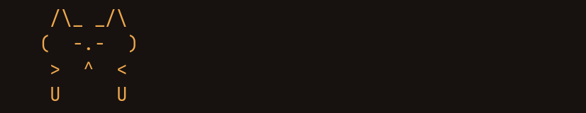
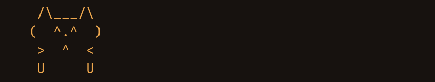

# kiln


A kitty terminal built around long Claude Code sessions, and the Claude Code
configuration that lives inside it. Warm dark palette, a real topographic map
of Oxford, Ohio behind the text, a bottom tab bar, and a statusline with a cat
that hops across it while Claude works.

macOS, Apple Silicon, kitty 0.46.2, JetBrains Mono Nerd Font at 14pt.


---

## Overview

Two halves that were designed against each other:

* **`kitty/`** — the terminal. 563 lines of `kitty.conf`, a palette (`kiln`)
  whose every slot is contrast audited, the background image generator that
  renders real USGS elevation data, and an 833 line `tab_bar.py` that is
  dormant on purpose (see below).
* **`claude/`** — what runs in it. A 1,122 line statusline that reads Claude
  Code's own payload rather than guessing, six subagent definitions, four
  hooks, and the colour-math library the palette is checked with.

Nothing here is a theme download. Every colour was measured, every piece of
terminal art was shaped through HarfBuzz before it shipped, and the config
comments record the measurements — including the ones that went the wrong way.

### Why it's interesting

* **The palette passes a real audit, not a vibe check.** `kitty-palcheck.py`
  gates every slot on WCAG 2.1, APCA 0.98G-4g, CIEDE2000 separation and
  Machado colour vision deficiency simulation. Foreground contrast is 14.90:1
  WCAG and APCA Lc 91.0. Red/green separation survives deuteranopia at
  dE00 13.6 against a floor of 12. All fifteen gates pass, and the script
  exits nonzero if any stops passing.
* **The terminal art is shaped, not eyeballed.** JetBrains Mono ligates
  aggressively and a ligature does not change the cell count, so a width check
  cannot catch one. The classic `=^.^=` cat face loses its right cheek because
  `^=` shapes to a single `asciicircum_equal.liga` glyph. `check-art` runs
  candidate art through HarfBuzz and reports the offending cluster by name.
* **The statusline reports the server's numbers.** Context percentage comes
  from `.context_window.used_percentage` in Claude Code's own payload, not
  from tailing the transcript. The transcript version was wrong three ways,
  and one of them is the "my context still shows the old number after
  `/compact`" bug.
* **The cat is animated, and the cost is stated.** ~21 ms per render at 1 Hz
  per open session, about 2% of one core. Both knobs to turn it down are
  documented next to the number.

---

## The look


**Palette.** `kiln` is a warm dark theme: ground `#17120f`, ember and clay
accents, cream foreground. It lives in `kitty/themes/kiln.conf` and is applied
last in the config so it overrides everything above it.

**Background.** `backgrounds/oxford-topo.png` is a contour render of Oxford,
Ohio — the Four Mile Creek valley system, from real elevation tiles. It
replaced two generated textures (a Penrose tiling and a poppy pattern), and
that category change was the point: the ground the last four years happened
on beats a procedural pattern. `oxford-topo-gen.py` regenerates it; the
rejected designs are kept as SVG source in the same directory.

**Tab bar.** Bottom edge, one row, `tab_bar_style separator`. It sits
directly under Claude Code's input box. Tab titles render the basename when
the title is a path, so a tab reads `3 kiln ×2` rather than
`3 /Users/ayush/.config/kit…`, with `×N` marking split panes. That is
`tab_title_template` doing the work, not Python.

**`tab_bar.py` is not loaded, deliberately.** A custom `draw_tab` only runs
under `tab_bar_style custom`, and this config sets `separator`. The file is
kept because a horizontal kitty tab bar is exactly one row — `Screen(None, 1,
…)` — and one row is not a stage, which is why the cat moved to the Claude
Code statusline. kitty 0.48 added vertical tab bars, where the bar is a real
multi-row screen, and the file becomes useful again there. Its docstring
carries the two porting notes. Do not read it as active code.

**Motion.** Exactly one animation in the terminal itself: `cursor_trail`,
which only has frames to draw while the cursor is actually moving. There is
no idle timer and no idle repaint. Everything else that moves was moved out
to the statusline on purpose, where its cost is measured separately.

The value is **milliseconds, not a trail length** — it is the time a cursor
must have sat still before a jump earns a trail, which is how kitty suppresses
trails during the constant repaints of a busy TUI. This config ships `3`,
which is low enough that the suppression effectively never engages, so the
trail does animate while Claude Code streams. Raise it if that bothers you.

---

## The keyboard

Every binding lives on `cmd` or `cmd+shift`, so `ctrl` and `alt` chords stay
free for the shell and for Claude Code. `cmd+/` opens this cheatsheet as an
overlay, generated from `kitty.conf` itself so there is no second file to
drift.


The two worth calling out for Claude Code work:

* **`cmd+alt+d`** splits 2/3 : 1/3 instead of 50/50. Claude Code truncates
  rows rather than wrapping them, so an even split of a 165 column window
  gives 81 columns a side and starts cutting output. Biased, the same window
  gives 108 and 54.
* **`cmd+shift+o`** copies the last command's entire output to the clipboard
  without selecting anything. This is the one to reach for after a build
  fails and Claude wants the log.

`shift+enter` is deliberately **not** mapped. A `send_text` map would hand the
app a bare `\n`, which many TUIs read as submit, breaking the multi-line input
the binding was supposed to provide.

---

## Working with Claude Code

### The statusline


One row of instruments and a four row stage under them. Everything on the
instrument row is read from the payload Claude Code sends on stdin. (The
figures in that screenshot are synthetic — it was rendered against a sandboxed
`$HOME`, so none of the gauges are real account usage.)

| Field | Source |
| --- | --- |
| context % and tokens | `.context_window.used_percentage`, `.total_input_tokens` |
| 5 hour and weekly usage | `.rate_limits.five_hour`, `.rate_limits.seven_day` |
| model, effort, fast mode | `.model`, `.effort.level`, `.fast_mode` |
| project and branch | `.workspace.current_dir` plus git |

No estimation anywhere. An earlier version summed tokens across every
transcript, divided by a guessed weekly denominator, read 62% when the truth
was 80%, and burned a 32 second pass to get there. The rate limit numbers are
the same ones `/usage` prints, free, with no API call.

### The cat

`statusLine.refreshInterval` is an integer seconds timer that re-runs the
command *in addition to* event driven updates. At `1`, two genuinely idle
sessions rendered exactly 20 times in 20 seconds; a working session rendered
62 times in the same 20 seconds. So the cat idles near 1 fps and quickens to
roughly 3 fps while Claude works, which is the right way round.

| idle | working |
| --- | --- |
|  |  |

Sub-second refresh is rejected and fails open loop: `0.5` is below the schema
minimum, gets silently discarded, and no timer is armed at all. Those same
idle sessions fell from 20 renders per 20 seconds to 1. Integer seconds, floor
of 1.

**It hops; it does not walk.** That is the whole design, and it was arrived at
by changing the verb rather than redrawing the art. At 1 fps there is no
apparent motion, so a walk cycle is a high frequency signal sampled at 1 Hz and
what comes back is aliasing. The cat now translates rigidly between two poses —
one channel, and it is the motion channel. Seven motions: hop, scamper, pounce,
stretch, yawn, sleep, and a moth it chases and misses.

The face changes with context pressure and the pose changes with whether
Claude is working:


Every sprite is exactly 9 cells wide and passes `check-art`:


### Subagents

`claude/agents/` holds six agents in two tiers. The routing rule is that the
main thread should never be the thing reading a 40,000 line test log.

| Agent | Model | For |
| --- | --- | --- |
| `yoda` | Fable 5 | Critique, plan cross-checks, second opinions. Read only. Expensive, so reserved for decisions that are costly to get wrong. |
| `picasso` | Opus 5 | Design and frontend work where judgement is the point. |
| `minion` | Opus 5 | Execution of a known plan, bulk edits, repros, minor fixes. |
| `labrat` | Opus 5 | Every test suite, e2e run, benchmark and long build. Returns a verdict, not the log. |
| `sherlock` | Opus 5 | External facts, cited. |
| `stig` | Opus 5 | Multi-step browser work. Absorbs page dumps so they never reach the main thread. |

The tier split is enforced mechanically, not by asking politely.
`hooks/frontend-no-suites.sh` is a `PreToolUse` hook that blocks `picasso`
from running a test suite at all, so the routing rule cannot be talked out of.

### Hooks

| Hook | Event | Does |
| --- | --- | --- |
| `frontend-no-suites.sh` | PreToolUse | Blocks suites and long builds for the design agent. |
| `session-context.sh` | SessionStart | Injects the workspace and VCS state, once, at session start. |
| `notify.sh` | Notification | Desktop notification when Claude needs input. |
| `stop-chime.sh` | Stop | Audible cue when a turn ends. |

`session-context.sh` is deliberately small. The version it replaced injected
"relevant memory" on *every* prompt at roughly 406 tokens and up to 7 seconds
each time, to surface a truncated fragment of the previous reply.

---

## Install

```bash
git clone https://github.com/yadava5/kiln.git
cd kiln
./install.sh
```

`install.sh` backs up anything it would overwrite to `<file>.pre-kiln-<date>`,
copies the trees into place, and rewrites the absolute paths in `kitty.conf`,
`kitty-keys`, `check-art` and `tab_bar.py` to your own home directory. It
prints every path it touches and takes `--dry-run`.

**Dependencies.** kitty 0.46+ and `JetBrainsMono Nerd Font Mono` are required.
**Use 0.48.2 or newer.** Everything here runs on 0.46.2, which is what the
screenshots were taken on, but 0.46.2 is affected by several kitty security
advisories including [GHSA-qfgm-2c64-6x3x](https://github.com/kovidgoyal/kitty/security/advisories/GHSA-qfgm-2c64-6x3x)
(CVSS 9.9) and [GHSA-w98g-hpvr-r332](https://github.com/kovidgoyal/kitty/security/advisories/GHSA-w98g-hpvr-r332),
both of which trigger on bytes merely being printed to the terminal. That is
the whole day when an agent is pasting fetched pages and build logs into it.
`allow_remote_control socket-only` does not mitigate the second one.
`jq` is required by the statusline. `python3` is required by
`check-art` and `kitty-palcheck.py` (and `tab_bar.py`, if you ever enable
it); `check-art` also needs `hb-shape` from
HarfBuzz. `eza`, `bat` and `starship` are what the screenshots show but
nothing here depends on them.

**Install the Mono variant of the font specifically.** The plain
"JetBrainsMono Nerd Font" family fails kitty's CoreText monospace check
because its icon glyphs have uneven advances, and kitty then silently falls
back to Menlo with a one line startup warning. Measured on kitty 0.46.2:
`get_font_files()` returns `Menlo-Regular` for the plain name and
`JetBrainsMonoNFM-Regular` for the Mono one.

**Changing the background path needs a full kitty restart**, not a config
reload. Worth knowing before concluding that a new background does not work.

### Claude Code side

The statusline needs this in `~/.claude/settings.json`:

```json
{
  "statusLine": {
    "type": "command",
    "command": "$HOME/.claude/statusline.sh",
    "padding": 0,
    "refreshInterval": 1
  }
}
```

`padding: 0` matters — the stage is sized in cells and padding steals them.

---

## Verify it

```bash
# The palette audit. Exits nonzero if any gate stops passing.
python3 claude/scripts/kitty-palcheck.py kitty/themes/kiln.conf

# The colour math itself, against published reference values.
python3 claude/scripts/palmath.py

# Shape terminal art against the live font before shipping it.
kitty/check-art '  /\_/\ ' ' ( o.o ) ' ' =^.^= '

# Every cat this setup can draw, at real size, in your own terminal.
kitty/kitty-cats

# Drift between this repo and the config actually installed.
tools/check-sync.sh

# Re-render the banner from the live statusline. If the banner is wrong,
# the statusline is wrong — nothing in the harness draws a cat.
python3 tools/make-banner.py
```

`check-sync.sh` is the one that matters over time. This repo is a mirror of
`~/.config/kitty` and `~/.claude`, and a mirror that nobody diffs goes stale
silently. It uses `/usr/bin/diff` explicitly, because a `diff` aliased to
difftastic has already reported two differing directories as identical here.

---

## Implemented vs delegated vs planned

### Implemented here

* The `kiln` palette, its APCA/WCAG/CVD audit, and the colour math library.
* `tab_bar.py` — a horizontal custom `draw_tab`, written and then shelved
  when the cat moved to the statusline. Dormant, not dead: it is the starting
  point for the 0.48 vertical bar.
* `statusline.sh` — payload parsing, rate limit gauges, the animated stage.
* `check-art` — HarfBuzz shaping gate for terminal art.
* `oxford-topo-gen.py` — fetches elevation tiles and renders the contours.
* `kitty-keys` — the `cmd+/` overlay, generated from `kitty.conf`.

### Delegated, on purpose

* Prompt marks, cursor shape and cwd reporting: kitty's `shell_integration`.
* Scrollback search and paging: `less`, via `scrollback_pager`.
* Fuzzy history: `atuin`. Prompt: `starship`. Neither is configured here.
* Colour vision simulation: the published Machado matrices, not a hand roll.

### Planned, not in this build

* **Vertical tab bar.** kitty 0.48 added `tab_bar_edge left|right`, and the
  vertical bar is a real multi-row `Screen` roughly 28 columns wide by the
  full window height — two orders of magnitude more cells than the one row
  strip. This install is on 0.46.2, so it is not available yet. Two porting
  notes already found in the 0.48.2 source: vertical mode calls `draw_tab`
  with `is_last=True` for *every* tab, and `ExtraData` is rebuilt per call so
  `prev_tab`/`next_tab` are always `None`.
* A `kitty --session` file that restores the working layout on launch.

### Rejected, with reasons

Kept because the reasons outlive the decisions:

* **Floating panel for the cat.** Dead end. kitty never wires up
  `GLFW_MOUSE_PASSTHROUGH`, so a `--layer=overlay` panel sits above the menu
  bar and eats every mouse event on the screen. Not fixable from config.
* **A dedicated split pane for it.** Works, at any framerate. Rejected because
  it steals pane space and is in the way while working.
* **A walking cat, in side profile.** Six versions, all rejected 2026-08-10,
  and this is the one to read before redrawing anything. A walk cycle is a
  high frequency signal being sampled at 1 Hz; what a viewer gets back is
  aliasing, so the animation reads as broken rather than alive. The side
  profile also put the face on screen only 60% of the time — the face is the
  reason anyone looks at it. Replaced by rigid two-pose translation, which is
  what the banner above shows. Do not reintroduce a walk cycle at this
  refresh rate.
* **A cheatsheet as the background image.** Shipped through three designs and
  failed all three. Text over a busy region is exactly what made it
  unreadable. The reference belongs on a key, which is what `cmd+/` is.

---

## Layout

```
kitty/
  kitty.conf            main config, 563 lines, comments carry the measurements
  current-theme.conf    applied last, overrides everything above it
  themes/kiln.conf      the palette
  tab_bar.py            custom draw_tab, DORMANT (needs tab_bar_style custom)
  kitty-keys            cmd+/ overlay, generated from kitty.conf
  kitty-cats            every cat this setup can draw, at real size
  kitty-theme           live palette switch over the control socket
  check-art             HarfBuzz shaping gate for terminal art
  shell.zsh             the per terminal shell furniture
  backgrounds/          oxford-topo.png + generator, and the rejected designs
claude/
  statusline.sh         the instruments and the stage
  statusline-demo.sh    renders the stage to GIFs without touching a live session
  stage-preview.py      the GIF harness: runs the real statusline, paints its bytes
  agents/               six subagent definitions
  hooks/                four hooks
  scripts/              kitty-palcheck.py, palmath.py
tools/
  check-sync.sh         drift gate: this repo vs what is installed
  make-banner.py        re-renders the banner and the two cat GIFs above
docs/media/             the screenshots and animations above
```

---

## What is not here

`block-destructive.sh` — the `PreToolUse` hook that is the real backstop
against destructive commands — is deliberately excluded. It documents exactly
how its matching works, and publishing that publishes the way around it.
`settings.json` is excluded for the same class of reason.

The elevation tile cache under `backgrounds/tiles/` is excluded as build
output. `oxford-topo-gen.py` refetches it in about 40 requests.

---

## Licence

MIT. See [LICENSE](LICENSE).

The Oxford topography is rendered from public USGS elevation data. JetBrains
Mono is licensed under the SIL Open Font License by JetBrains and is not
redistributed here.

## Author

Ayush Yadav — [ayush-yadav.com](https://ayush-yadav.com) · [github.com/yadava5](https://github.com/yadava5)
