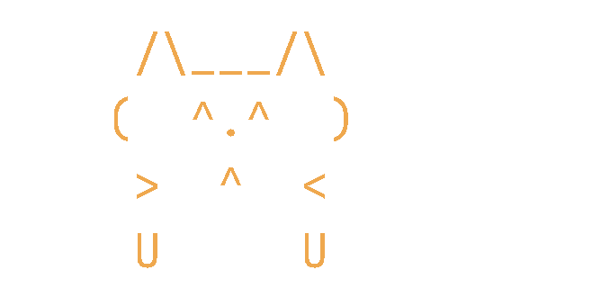

<p align="center">
  
</p>

<h1 align="center">kiln</h1>

<p align="center">
  A kitty terminal built around long Claude Code sessions,<br>
  and the Claude Code configuration that lives inside it.
</p>

macOS, Apple Silicon, kitty 0.46.2, JetBrains Mono Nerd Font at 14pt.


---

## How it fits together


Nothing here is a theme download:

* **Every colour is measured.** Fifteen gates — WCAG 2.1, APCA 0.98G-4g,
  CIEDE2000, Machado colour-vision-deficiency simulation — re-run by CI on
  every push, with a negative control proving the audit can fail.
* **Every piece of terminal art is shaped through HarfBuzz before it ships.**
  A ligature preserves the cell count, so a width check cannot catch one;
  `check-art` names the offending cluster instead.
* **The statusline reports the server's numbers**, read from Claude Code's own
  payload, never estimated from transcripts.
* **The animation's cost is stated:** ~21 ms per render at 1 Hz per open
  session, about 2% of one core, with both knobs to turn it down documented
  next to the number.

---

## The palette


`kiln` is a warm dark theme — fired-clay ground `#17120f`, ember accent,
parchment text. It lives in `kitty/themes/kiln.conf`, applied last so it
overrides everything above it, and the config comments carry the measurements —
including the ones that went the wrong way.


Reproduce every number:

```bash
python3 claude/scripts/kitty-palcheck.py kitty/themes/kiln.conf
```

---

## The terminal

**Background.** `backgrounds/oxford-topo.png` is a contour render of Oxford,
Ohio — the Four Mile Creek valley system, from real USGS elevation tiles. It
replaced two generated textures, and that category change was the point: the
ground the last four years happened on beats a procedural pattern.
`oxford-topo-gen.py` regenerates it. Changing the background path needs a full
kitty restart, not a config reload.

**Tab bar.** Bottom edge, one row, directly under Claude Code's input box. Tab
titles render the basename when the title is a path — `3 kiln ×2`, not
`3 /Users/ayush/.config/kit…` — with `×N` marking split panes. That is
`tab_title_template` doing the work, not Python.

**`tab_bar.py` is not loaded, deliberately.** A custom `draw_tab` only runs
under `tab_bar_style custom` and this config sets `separator`. The 833-line
file is kept because kitty 0.48's vertical tab bar is a real multi-row screen
where it becomes useful again; its docstring carries the two porting notes. Do
not read it as active code.

**Motion.** One animation in the terminal itself: `cursor_trail`. Its value is
milliseconds, not a trail length — the stillness a cursor must earn before a
jump draws a trail. This config ships `3`, low enough that the trail animates
while Claude Code streams; raise it if that bothers you. Everything else that
moves lives in the statusline, where its cost is measured separately.

---

## The keyboard

Every binding lives on `cmd` or `cmd+shift`, leaving `ctrl` and `alt` chords
free for the shell and for Claude Code. `cmd+/` opens the cheatsheet as an
overlay, generated from `kitty.conf` itself so there is no second file to
drift.


Five worth calling out for Claude Code work:

* **`cmd+alt+d`** splits 2/3 : 1/3 instead of 50/50. Claude Code truncates
  rows rather than wrapping them; an even split of a 165-column window gives
  81 columns a side and starts cutting output. Biased, 108 and 54.
* **`cmd+shift+o`** copies the last command's entire output to the clipboard.
  The one to reach for after a build fails and Claude wants the log.
* **`cmd+alt+g`** pages the output of the command `cmd+up` last jumped to.
  `cmd+shift+g` can only ever give the *last* command; this gives the one you
  walked back to. Walk back three builds, open that build's output alone.
* **`cmd+shift+up` / `cmd+shift+down`** jump between the `error` / `warn` /
  `fail` marks `cmd+shift+m` paints. That binding highlighted them across
  20,000 lines and then gave no way to reach one — you still scrolled looking
  for colour. These are the missing half of it, and they are inert while the
  marker is off.
* **`cmd+shift+j`** picks a pane by label — and with only two panes open it
  skips the overlay and switches directly, so it is a zero-thought toggle.

`shift+enter` is deliberately **not** mapped: a `send_text` map would hand the
app a bare `\n`, which many TUIs read as submit.

---

## The statusline


An earlier version summed tokens across every transcript, divided by a guessed
weekly denominator, read 62% when the truth was 80%, and burned a 32-second
pass to get there. The current one parses the JSON Claude Code writes to
stdin and is right by construction.


`statusLine.refreshInterval` is an integer-seconds timer on top of
event-driven updates. Measured at `1`: two genuinely idle sessions rendered
exactly 20 times in 20 seconds; a working session rendered 62 times. So the
cat idles near 1 fps and quickens to roughly 3 fps while Claude works — the
right way round. Sub-second values are below the schema minimum and are
silently discarded: no timer at all, 1 render in 20 seconds.

### The cat

| idle — 1 render a second | working — ~3 a second |
| --- | --- |
|  |  |

**It hops; it does not walk.** At 1 fps there is no apparent motion — a walk
cycle is a high-frequency signal sampled at 1 Hz, and what comes back is
aliasing. The cat translates rigidly between two poses instead: one channel,
and it is the motion channel. Seven motions — hop, scamper, pounce, stretch,
yawn, sleep, and a moth it chases and misses. The face changes with context
pressure; the pose changes with whether Claude is working.


Every sprite is exactly 9 cells wide and passes `check-art` — the classic
`=^.^=` face fails it, because `^=` shapes to a single
`asciicircum_equal.liga` glyph and loses a cell:


---

## The activity dashboard

`cmd+shift+a` opens an overlay showing what the machine and the agents are
actually doing. `q` closes it.


It costs nothing until it is open, which is why it is a key rather than a pane
— the same reason the terminal itself has no idle repaints.

Every number is sampled from a real source, and the cheap way was measured
rather than assumed:

| Row | Source |
| --- | --- |
| cpu | `host_statistics(HOST_CPU_LOAD_INFO)` via `ctypes` — the same tick counters `top` differences, 0.8 ms a sample |
| mem | `vm_stat` pages: active + wired + compressed against `hw.memsize` |
| net | `netstat -ib` totals, differenced between frames |
| sessions | `~/.claude/sessions/*.json`, which the CLI maintains, joined to `ps` for CPU and RSS |
| agents | `~/.claude/projects/*/*/subagents/agent-*.jsonl` — mtime is the liveness signal, model and tokens come from the last record carrying them |
| gauges | `~/.claude/cache/ratelimits` and `fablelimit`, the same files the statusline reads |

`ps -A -o %cpu` was tried first for CPU and read **8.2%** when the true figure
was **15.1%**, because macOS reports a decaying per-process average. `top -l 1`
is accurate but costs 390 ms, which is a fifth of a two second tick. The tick
counters are both accurate and free.

Agent transcripts reach megabytes, so only the tail is read and a parse is
cached against size and mtime; a finished agent is never re-read.

**The glyphs were shaped before they shipped.** `check-art` says the vertical
ramp `▁▂▃▄▅▆▇█`, the eighths ramp `▏▎▍▌▋▊▉█` and the box drawing are all one
glyph per cell in JetBrains Mono. Braille is **not in the font at all** — it
renders as tofu — and neither are the statusline's own `▰▱` gauge blocks, which
kitty silently falls back to another face to draw. Nothing here uses either.

---

## Agents and hooks


The routing rule is that the main thread should never be the thing reading a
40,000-line test log — and the tier split is enforced mechanically, not by
asking politely.

The other three hooks, in one line each: `session-context.sh` injects
workspace and VCS state once at session start (its predecessor injected ~406
tokens and up to 7 seconds of "relevant memory" on *every* prompt);
`notify.sh` raises a desktop notification when Claude needs input;
`stop-chime.sh` sounds when a turn ends.

---

## Install

```bash
git clone https://github.com/yadava5/kiln.git
cd kiln
./install.sh
```

`install.sh` backs up anything it would overwrite to `<file>.pre-kiln-<date>`,
copies the trees into place, and rewrites the absolute paths to your own home
directory. It prints every path it touches and takes `--dry-run`.

**Dependencies.** kitty 0.46+ and `JetBrainsMono Nerd Font Mono` are required;
`jq` for the statusline; `python3` for `check-art`, `kitty-palcheck.py` and
the dormant `tab_bar.py`; `hb-shape` (HarfBuzz) for `check-art`. `eza`, `bat`
and `starship` appear in the screenshots but nothing depends on them.

**Use kitty 0.48.2 or newer.** Everything here runs on 0.46.2, which is what
the screenshots show, but 0.46.2 is affected by
[GHSA-qfgm-2c64-6x3x](https://github.com/kovidgoyal/kitty/security/advisories/GHSA-qfgm-2c64-6x3x)
(CVSS 9.9) and
[GHSA-w98g-hpvr-r332](https://github.com/kovidgoyal/kitty/security/advisories/GHSA-w98g-hpvr-r332),
both triggered by bytes merely being printed to the terminal — which is the
whole day when an agent is pasting fetched pages and build logs into it.
`allow_remote_control socket-only` does not mitigate the second one.

**Install the Mono variant of the font specifically.** The plain
"JetBrainsMono Nerd Font" family fails kitty's CoreText monospace check and
kitty silently falls back to Menlo with a one-line startup warning. Measured
on 0.46.2: `get_font_files()` returns `Menlo-Regular` for the plain name,
`JetBrainsMonoNFM-Regular` for the Mono one.

### Claude Code side

The statusline needs this in `~/.claude/settings.json` — `padding: 0`
matters, because the stage is sized in cells and padding steals them:

```json
{
  "statusLine": {
    "type": "command",
    "command": "$HOME/.claude/statusline.sh",
    "padding": 0,
    "refreshInterval": 1
  }
}
```

---

## Verify it

```bash
# The palette audit. Exits nonzero if any gate stops passing.
python3 claude/scripts/kitty-palcheck.py kitty/themes/kiln.conf

# The colour math itself, against published reference values.
python3 claude/scripts/palmath.py

# Shape terminal art against the live font before shipping it.
kitty/check-art '  /\_/\ ' ' ( o.o ) ' ' =^.^= '

# Every cat this setup can draw, at real size, in your own terminal.
kitty/kitty-cats

# One frame of the activity dashboard, no alt-screen — pipeable.
kitty/kiln-top --once

# Drift between this repo and the config actually installed.
tools/check-sync.sh

# Re-render the banner and statusline GIFs from the live statusline. If they
# are wrong, the statusline is wrong — nothing in the harness draws a cat.
python3 tools/make-banner.py
```

`check-sync.sh` is the one that matters over time: this repo is a mirror of
`~/.config/kitty` and `~/.claude`, and a mirror nobody diffs goes stale
silently. It calls `/usr/bin/diff` explicitly, because a `diff` aliased to
difftastic has already reported two differing directories as identical here.

---

## Decisions

**Delegated on purpose.** Prompt marks, cursor shape and cwd reporting:
kitty's `shell_integration`. Scrollback search: `less`. Fuzzy history:
`atuin`. Prompt: `starship`. Colour-vision simulation: the published Machado
matrices, not a hand roll.

**Planned.** A vertical tab bar — kitty 0.48's `tab_bar_edge left` makes the
bar a real multi-row screen, which is what `tab_bar.py` is waiting for. A
`kitty --session` file that restores the working layout.

**Rejected, with reasons** — kept because the reasons outlive the decisions:

* **A walking cat, in side profile.** Six versions, all rejected 2026-08-10.
  A walk cycle sampled at 1 Hz aliases and reads as broken, and the side
  profile put the face on screen only 60% of the time — the face is the
  reason anyone looks. Replaced by rigid two-pose translation, which is what
  the banner shows. Do not reintroduce a walk cycle at this refresh rate.
* **A floating panel for the cat.** kitty never wires up
  `GLFW_MOUSE_PASSTHROUGH`, so an overlay panel eats every mouse event on the
  screen. Not fixable from config.
* **A dedicated split pane for it.** Works at any framerate; steals pane
  space and is in the way while working.
* **A cheatsheet as the background image.** Three designs, all unreadable —
  text over a busy region. The reference belongs on a key: `cmd+/`.

---

## Layout

```
kitty/
  kitty.conf            main config, 563 lines, comments carry the measurements
  current-theme.conf    applied last, overrides everything above it
  themes/kiln.conf      the palette
  tab_bar.py            custom draw_tab, DORMANT (needs tab_bar_style custom)
  kitty-keys            cmd+/ overlay, generated from kitty.conf
  kiln-top              activity dashboard: machine, sessions, agents (cmd+shift+a)
  kitty-cats            every cat this setup can draw, at real size
  kitty-theme           live palette switch over the control socket
  check-art             HarfBuzz shaping gate for terminal art
  shell.zsh             the per-terminal shell furniture
  backgrounds/          oxford-topo.png + generator, and the rejected designs
claude/
  statusline.sh         the instruments and the stage, 1,122 lines
  statusline-demo.sh    renders the stage to GIFs without touching a live session
  stage-preview.py      the GIF harness: runs the real statusline, paints its bytes
  agents/               six subagent definitions
  hooks/                four hooks
  scripts/              kitty-palcheck.py, palmath.py
tools/
  check-sync.sh         drift gate: this repo vs what is installed
  make-banner.py        re-renders the banner and statusline GIFs above
docs/media/             the screenshots, figures and animations above
```

---

## What is not here

`block-destructive.sh` — the `PreToolUse` hook that is the real backstop
against destructive commands — is deliberately excluded: it documents exactly
how its matching works, and publishing that publishes the way around it.
`settings.json` is excluded for the same class of reason. The elevation tile
cache is build output; `oxford-topo-gen.py` refetches it in about 40 requests.

## Licence

MIT. See [LICENSE](LICENSE).

The Oxford topography is rendered from public USGS elevation data. JetBrains
Mono is licensed under the SIL Open Font License by JetBrains and is not
redistributed here. The figures under `docs/media/` embed subsets of
[Bitter](https://github.com/solmatas/Bitter) (SIL OFL 1.1).

## Author

Ayush Yadav — [ayush-yadav.com](https://ayush-yadav.com) · [github.com/yadava5](https://github.com/yadava5)
