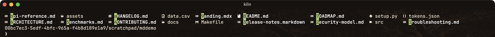

# Binding verification — 2026-08-22

Every key binding added on 2026-08-21/22 was exercised against a running kitty
and read back from a measurable quantity. Two of them were broken. This file
records the instrument as much as the result, because the instrument is what
took the longest to get right.

## What was wrong

`cmd+shift+v` reported `No matches found with pattern: (?m)S+.(?:md|markdown|mdx)b`
against a directory holding nineteen markdown files. The backslashes are gone
from that pattern, and they were present in the config.

kitty's config parser preserves them. `kitten @ ls` shows the definition exactly
as written. They are removed one layer later, when kitty splits the stored
definition into argv:

| form written in `kitty.conf` | what the action receives |
| --- | --- |
| `--regex (?m)\S+\.(?:md\|mdx)\b` | `(?m)S+.(?:md\|mdx)b` |
| `--regex "(?m)\S+\.(?:md\|mdx)\b"` | `(?m)S+.(?:md\|mdx)b` |
| `--regex '(?m)\S+\.(?:md\|mdx)\b'` | `(?m)\S+\.(?:md\|mdx)\b` |
| `--regex (?m)\\S+\\.(?:md\|mdx)\\b` | `(?m)\S+\.(?:md\|mdx)\b` |

Double quotes do **not** protect a backslash here, unlike a POSIX shell and
unlike Python's `shlex`. Single quotes do, and that is the fix.

The same defect had already shipped in a second binding nobody had connected to
it. `map cmd+shift+m toggle_marker iregex 1 \berror\b …` parsed to `berrorb`,
so `cmd+shift+m` marked nothing, so `cmd+shift+up` / `cmd+shift+down`
(`scroll_to_mark`) had nothing to jump to. Three advertised keys, one cause.

`tools/check-map-escapes.py` now gates this, and CI runs it against a copy of
the config with the quotes stripped back out — the gate has been watched
rejecting the exact line that shipped.

## The instrument

Every test ran against a **staged** kitty (`--instance-group=kilnverify`,
its own socket), never the live instance running Claude Code sessions.

**`kitten @ send-key` cannot test a binding.** It writes the encoded chord to
the child process's tty, which is the step kitty performs *after* its own
dispatcher declines the key — it is literally the mechanism that produced the
`8;10u` text in the original bug report. Measured: `send-key cmd+shift+enter`
left `layout` at `splits`; `@ action toggle_layout stack` flipped it to `stack`.

So the chain is verified in two halves, both mechanical:

* **chord → definition**, by loading the real `kitty.conf` through kitty's own
  parser and reading `keyboard_modes[""].keymap`, then splitting the definition
  the way kitty does. This is the half where the bug lived.
* **definition → effect**, by running the definition verbatim through
  `@ action` and reading back a quantity: layout name, per-window `columns`,
  the `neighbors` map, screen text. Never a screenshot judgement — a
  multi-argument action passed as separate words is a *silent* no-op, and a
  screenshot cannot tell that apart from a broken binding.

Interactive kittens turned out to be drivable after all: `@ send-text` reaches
the kitten's tty, so hint labels can be pressed. Esc must be sent as `CSI 27u`,
not a bare `\x1b`, because the kitten has the kitty keyboard protocol on.

## Results

| key | action | how it was read back | |
| --- | --- | --- | --- |
| `cmd+shift+enter` | `toggle_layout stack` | tab `layout` splits → stack | ok |
| `cmd+shift+j` | `focus_visible_window` | active window flipped 2 → 1 | ok |
| `cmd+shift+s` | `swap_with_window` | `neighbors` right → left | ok |
| `cmd+alt+b` | `layout_action bias 67` | columns 85/85 → 55/115 (67.6%) | ok |
| `cmd+shift+r` | `reset_window_sizes` | columns 55/115 → 85/85 | ok |
| `cmd+alt+enter` | `layout_action rotate` | neighbors left/right → top/bottom | ok |
| `cmd+shift+m` | `toggle_marker iregex …` | see below | **fixed** |
| `cmd+shift+up` | `scroll_to_mark prev` | screen top → `sentinel ERROR alpha` | **fixed** |
| `cmd+shift+down` | `scroll_to_mark next` | mark scrolled into view at line 42 | **fixed** |
| `cmd+shift+k` | `scroll_prompt_to_top y` | prompt moved to screen line 1 | ok |
| `cmd+alt+g` | pager on `@last_visited_cmd_output` | overlay `less` showing `CMD-A-END`, `(END)` | ok |
| `cmd+shift+a` | `kiln-top-open` | tab `activity` created; second press does not duplicate | ok |
| `cmd+shift+u` | `kiln-top-open btop` | tab `btop` created, btop drawing | ok |
| `cmd+shift+v` | hints → `kiln-md` | labels on all eleven `.md` / `.markdown` / `.mdx` files, none on the directories, `data.csv`, `Makefile`, `setup.py` or `tokens.json` | **fixed** |
| `cmd+alt+f` | hints path, multiple | two labels pressed, both pasted at the prompt | ok |
| `cmd+shift+e` | hints line | whole line pasted at the prompt | ok |
| `cmd+/` | `kitty-keys` overlay | rendered in full, all four sections | ok |

The marker pair was verified as a **paired control** rather than a single
observation: the old unquoted spec left `scroll_to_mark prev` motionless
(0 sentinels on screen), the single-quoted spec moved the viewport to the mark.
Same window, same scrollback, one character of difference.

The hints overlay for `cmd+shift+v`, captured while open, against a directory
built for the shot. Every markdown file carries a label — including the
`.markdown` and `.mdx` spellings — and nothing else does.

## Two things checked one layer past the regex

* **cwd.** `hints --program` hands over the *literal* matched text, and eza
  prints relative names. Replacing `kiln-md` with a probe that logs its
  environment recorded `CWD=…/mddemo` and `ARG=release-notes.markdown` — the
  program inherits the source window's directory, so a bare filename resolves.
  The nerd-font icon eza prints before each name is not swallowed by `\S+`.
* **what `cmd+shift+v` actually opens.** `kiln-md` defaults to the browser, not
  a terminal pane. Selecting a hint renders the file through
  `gh api /markdown --mode gfm`, writes `kiln-md-<path>.html` into the temp
  directory — 64,366 bytes for this repo's own README — and calls
  `/usr/bin/open`. Nothing appears in kitty by design; `kiln-md -t FILE` is the
  in-terminal one.

## Still not verified

Mouse maps, and whether the hints overlay paints under his own key press rather
than a remote action. The overlay was screenshotted while open, so it draws;
the last link only his keyboard can close.
